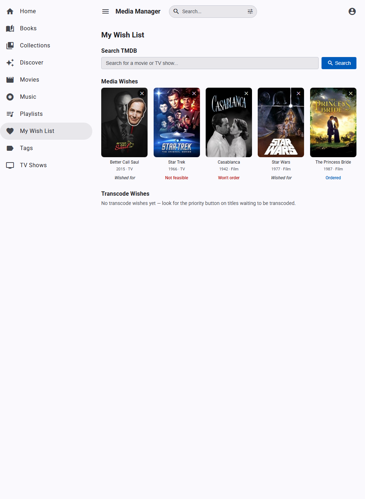

  

# User Guide

Everything you need to know about browsing, searching, and watching your media collection.

---

## Home Screen

The home screen is your personalized dashboard. It shows:

- **Continue Watching** &mdash; Titles you're partway through, with progress bars and a play button to resume instantly. Click the &times; to dismiss.
- **Recently Added** &mdash; The latest titles linked to transcoded files, ready to watch.
- **Recently Watched** &mdash; Titles you've finished recently.
- **New Seasons Available** &mdash; TV shows in your collection where TMDB indicates newer seasons exist. Add them to your wish list or dismiss.

---

## Browsing the Catalog

Open **Catalog** from the sidebar to see your full collection. Every title shows its poster, release year, content rating badge, and media format icon.

### Filtering

- **Search bar** &mdash; Type to filter by title name (see [Search Syntax](#search-syntax) below)
- **Tag filter** &mdash; Select one or more tags from the multi-select dropdown to narrow results (e.g., "Action", "Favorites")
- **Status filter** &mdash; Show titles needing attention (unenriched, unmatched, etc.)

### Sorting

Click any column header to sort. The catalog defaults to alphabetical by sort name.

---

## Search Syntax

The search box in the top navigation bar and the catalog search field both support the same syntax:

| Syntax | Example | Meaning |
|--------|---------|---------|
| `term` | `batman` | Must contain the word (multiple terms are AND'd) |
| `"phrase"` | `"dark knight"` | Exact phrase match |
| `-term` | `-lego` | Exclude titles containing the word |
| `tag:name` | `tag:action` | Filter to titles with a matching tag or genre |

**Combine them freely:** `"dark knight" -sequel tag:action` finds titles containing the exact phrase "dark knight", tagged "action", excluding any with "sequel".

The navbar search also matches **actor names** &mdash; start typing an actor's name and select their result (shown with a headshot) to jump to their filmography page.

---

## Title Detail Page

Click any title to open its detail page.

### What you'll see

- **Hero section** &mdash; Backdrop image, poster, title, year, rating, runtime, genres, and description
- **Play button** &mdash; Green play button appears when a browser-playable transcode exists
- **Cast row** &mdash; Scrollable headshots of the top cast members; click any to see their filmography
- **Tags** &mdash; Colored pill badges showing applied tags; click any to browse that tag
- **Similar Titles** &mdash; Recommendations based on shared genres, cast, and TMDB data
- **TV Episodes** &mdash; For TV series, an episode grid grouped by season with per-episode play buttons and resume indicators

### Actions

- **Star** (star icon) &mdash; Request priority transcoding for this title. When you first set up Media Manager, you may have weeks or months of transcode backlog processed in popularity order. Starring a title bumps it to the top of the queue so it becomes playable sooner. Starred titles show a gold star in the catalog.
- **Hide for me** &mdash; Remove from your personal catalog and search results (doesn't affect other users; reversible from the title detail page)

---

## Watching Videos

### In-Browser Playback

Click the green play button on any title or episode. The video player opens as a dialog overlay.

**Controls:**
- Standard HTML5 video controls (play/pause, volume, fullscreen)
- **Seek thumbnails** &mdash; Hover over the progress bar to see thumbnail previews of the video at that point
- **Resume prompt** &mdash; If you have saved progress, you're offered "Resume from M:SS" or "Start Over"
- **Auto-play next** &mdash; For TV episodes, a "Next Episode" prompt appears near the end with a countdown

**Progress tracking:**
- Your position is saved automatically every 60 seconds and when you pause or close the player
- Progress carries across devices (browser, Roku)
- When you've watched 95% or more, progress is cleared automatically and the title is marked as "Viewed"

### What can I play?

| Source Format | Plays? | How |
|--------------|--------|-----|
| MP4 / M4V | Immediately | Streamed directly |
| MKV / AVI | After transcoding | Background transcoder creates a browser-safe MP4 copy |

The play button only appears once a playable version exists. The transcoding queue prioritizes popular titles and user requests.

---

## Personalizing Your Library

### Priority Transcoding

Star any title from its detail page to request priority transcoding. The background transcoder normally processes titles in decreasing TMDB popularity order, but starred titles jump to the front of the queue. Once transcoded, the play button appears. Starred titles also show a gold star icon in the catalog grid.

### Personal Hide

Don't want to see a title? Click "Hide for me" on its detail page. It vanishes from your catalog, search results, and home screen rows &mdash; but remains visible to other users. To un-hide, navigate directly to the title's URL and click "Unhide."

### Content Rating Ceiling

Your admin may configure a maximum content rating for your account (e.g., PG-13). Titles rated above your ceiling are automatically hidden everywhere &mdash; catalog, search, home screen, and Roku feed. This is account-level, not a parental lock PIN.

### Subtitles

Toggle subtitles on or off from your profile settings. When enabled, subtitles appear automatically during browser and Roku playback for titles that have generated subtitle files.

### Passkeys

Passkeys let you sign in with Face ID, Touch ID, or a hardware security key instead of typing your password each time. They are a convenience for faster re-login &mdash; your password still works normally.

**Registering a passkey:** Open your **Profile** page and scroll to the **Passkeys** section. Click "Register new passkey" and follow the browser prompt. You can give each passkey a name (e.g., "iPhone" or "YubiKey") to tell them apart.

**Signing in with a passkey:** On the login page, click "Sign in with passkey." Your browser will show a credential picker &mdash; select the passkey and authenticate with your device biometric or PIN.

**Managing passkeys:** From your Profile page you can see all registered passkeys with their creation and last-used dates. Delete any passkey you no longer use.

**Important:** Changing your password invalidates all registered passkeys. You will need to re-register them after a password change.

---

## Wish Lists

Open **My Wish List** from the sidebar. Your wish list lets you request new media and track priority transcoding.

### Media Wishes

Movies or shows you'd like the collection owner to buy as physical media. Search TMDB by name or browse actor filmography pages to find titles and add them. For TV shows, you can wish for a specific season.

**Finding titles to wish for:**
- **Search** &mdash; Type a title name in the search box at the top of the wish list page and click a result to add it
- **Actor pages** &mdash; Click any actor's headshot elsewhere in the app, then click the wish-list button on titles in their "Other Works" section

**Status tracking** &mdash; After you submit a wish, the collection admin reviews it. You'll see status updates on your wish list:

| Status | Meaning |
|--------|---------|
| *(no badge)* | Wish is active &mdash; the admin hasn't acted on it yet |
| **Ordered** | The admin has ordered the title |
| **Won't be purchased** | The admin has declined the request |
| **Not yet available** | The title isn't available for purchase yet |
| **Added to collection** | The title has been acquired and added to the catalog, but isn't transcoded for playback yet |
| **Ready to watch!** | The title is in the catalog with a playable transcode &mdash; click the poster to start watching |

When a wish is fulfilled ("Added to collection" or "Ready to watch!"), click **Dismiss** to clear it from your list. A badge on the sidebar's "My Wish List" link shows how many fulfilled wishes are waiting to be dismissed.

### Transcode Wishes

Titles that exist in the catalog but aren't yet playable in the browser (the source MKV hasn't been transcoded to MP4 yet). Request priority transcoding from the title detail page using the star icon &mdash; wished titles jump ahead in the transcoding queue. Your wish list shows live progress as transcoding runs.

---

## Family Videos

Family Videos is an optional feature that is off by default. A server admin must enable it in Settings before the Family link appears in the sidebar. Once enabled, open **Family** from the Content section in the sidebar to browse your family video collection. This section is separate from the movie/TV catalog and is designed for personal recordings &mdash; home movies, recitals, sports events, vacations, and anything else you've filmed.

### Browsing

The Family Videos page shows a card grid with poster-style thumbnails, titles, event dates, descriptions, and family member badges. Each card also shows a play button icon if the video is ready to watch, and a progress bar if you've started watching.

### Filtering &amp; Sorting

Filter chips across the top let you narrow the grid:

- **Playable** &mdash; Toggle to show only videos with a browser-playable transcode
- **Family member chips** &mdash; Click one or more names to filter to videos featuring those people. Click "All People" to clear the filter.
- **Sort chips** &mdash; Choose between Newest (event date), Oldest, Name (alphabetical), or Recently Added (creation date)

### Title Detail for Family Videos

Click any card to open the title detail page, which shows:

- **Hero image** &mdash; A poster-style thumbnail extracted from the video (set by an admin)
- **Event date** &mdash; When the video was filmed
- **Description** &mdash; Notes about the video
- **People in this Video** &mdash; Family members tagged in the video, shown as initial circles with names and ages at the time of filming (if birth dates are set)
- **Play button** &mdash; Watch the video in the browser player with full progress tracking and resume support

### Playback

Family videos use the same in-browser player as movies and TV shows. Your watch progress is saved automatically, and videos appear in the **Continue Watching** row on the home screen just like any other content.

---

## Actor Pages

Click any actor's headshot (from a title detail page or search results) to see their filmography page. This shows:

- Actor photo and name
- **In Your Collection** &mdash; Titles they appear in that you own
- **Other Works** &mdash; Their broader filmography from TMDB, filtered to remove trivial guest appearances. Click any to add it to your media wish list.

---

## Live Cameras

If your admin has configured security cameras, a **Cameras** link appears in the Content section of the sidebar.

### Browser Grid

The camera grid shows live feeds from all enabled cameras in a responsive layout (2&times;2 for up to 4 cameras, 3&times;3 for more). Each cell displays the camera name and a live MJPEG stream.

**Controls:**
- **Click any camera** to open it fullscreen in a dialog overlay
- **Live / Snapshot toggle** &mdash; Switch between continuous MJPEG streaming (higher bandwidth) and periodic snapshot polling (lower bandwidth, refreshes every 2&ndash;3 seconds)

Live camera feeds require no special setup &mdash; if cameras are configured and you can see the Cameras link, they're ready to watch.

### Roku Cameras

The Roku channel includes a camera list accessible from the **Cameras** button on the home screen (only visible when cameras are configured). Select a camera to watch its live HLS stream. The live player has no seeking or progress tracking &mdash; it's a continuous live view. Press **Back** to return to the camera list.

---

## Live TV

If your admin has configured an OTA tuner (e.g., HDHomeRun), a **Live TV** link appears in the Content section of the sidebar.

### Watching

The Live TV viewer shows a full-screen video player with a channel control bar at the top:

- **Left/Right arrows** or **channel buttons** &mdash; Step through channels one at a time
- **Channel picker** &mdash; Jump to any channel by name or number
- **Full screen** &mdash; Click the expand button (or press F11) to fill the screen
- **Arrow keys** &mdash; Left and right arrow keys also step channels

When you tune to a channel, a loading spinner appears while the server starts the stream (typically 10&ndash;15 seconds). The status indicator in the upper right shows the current state: Tuning, Buffering, Playing, or error conditions.

### Channel Quality Filter

Channels are filtered by a quality threshold you can set in your **Profile** page. The default is 4 (out of 5), meaning you only see channels your admin has rated as high quality reception. Lower the threshold to see more channels, or raise it to hide channels with marginal signal.

### Channel Unavailable

If a channel has no signal (poor antenna reception), you'll see a "No signal on this channel" message. Try another channel using the arrow keys or the channel picker.

### URL Persistence

The current channel is saved in the URL (e.g., `/live-tv/4.1`). Bookmarking or reloading the page returns you to the same channel.

### Roku Live TV

On the Roku channel, Live TV channels appear as a carousel row on the home screen and via a **Live TV** button in the header. Select any channel to tune directly. Use **Left/Right** during playback to step through channels, and **OK** to show the channel info overlay. See the [Roku Guide](ROKU_GUIDE.md#live-tv) for full details.

---

## Roku Playback

Media Manager includes a custom Roku channel for TV playback. See the [Roku Setup Guide](ROKU_GUIDE.md) for installation. Once paired, your library appears on the Roku with poster art, episode grids, and playback progress synced with the browser. The Roku channel also supports full-text search with landing pages for collections, tags, genres, and actors, plus wishlist integration from actor pages.

---

## iOS App

Media Manager has a native iOS app for iPhone and iPad. The app connects to your server's gRPC and HTTP endpoints and provides the same browsing, searching, and playback experience as the browser, plus offline downloads for watching without a network connection.

### Getting Connected

1. Open the app and enter your server's URL (e.g., `https://media.example.com`)
2. The app discovers the server and prompts for your username and password
3. Once authenticated, your full library appears in the sidebar

The app uses the same accounts and permissions as the web UI &mdash; your playback progress, wish list votes, and favorites sync across all devices.

### Downloading for Offline Playback

When the server has the **downloads** capability enabled, you can download movies for offline playback.

**To download a title:**
1. Open any movie's detail page
2. Tap the **Download** button (arrow icon) in the action row below the play button
3. The download begins in the background &mdash; you can continue browsing

**Download management:**
- Open the **Downloads** tab in the sidebar to see active and completed downloads
- Swipe left on any completed download to delete it
- The storage section at the bottom shows how much space downloads use and how much free space remains
- Downloads include subtitles, thumbnail previews, and skip segment data when available

**What gets cached:** When a download completes, the app also caches the title's detail page, poster and backdrop images, cast headshots, and (for TV shows) season and episode listings. This means you can browse a downloaded title's full detail page, navigate its seasons and episodes, and see cast information &mdash; all without a connection.

**TV episodes:** Individual episodes can be downloaded. The episode list shows which episodes are available offline and which require a connection.

### Offline Mode

Offline mode lets you use the app with only your downloaded content, without contacting the server. There are three ways to enter offline mode:

1. **Manual toggle** &mdash; Flip the **Online/Offline** switch at the bottom of the sidebar. The app immediately switches to showing only downloaded content.

2. **Automatic detection** &mdash; If you lose network connectivity (airplane mode, poor signal), the app detects this and enters offline mode automatically. When connectivity returns, it switches back.

3. **Server unreachable** &mdash; If the app can authenticate but can't reach the server (server is down, network path blocked), it offers an alert: "Server Unreachable &mdash; Go Offline?" Tapping **Go Offline** engages offline mode so you can watch your downloaded content instead of staring at a loading spinner.

### What Works Offline

| Feature | Offline? | Notes |
|---------|----------|-------|
| Browse downloaded titles | Yes | Title detail, seasons, episodes from cache |
| Play downloaded content | Yes | Full playback with subtitles, thumbnails, skip segments |
| Playback progress | Queued | Position saved locally, synced to server when back online |
| Home screen | No | Requires server |
| Catalog browsing | No | Requires server |
| Search | No | Requires server |
| Wish list | No | Requires server |
| Actor pages | No | Requires server |
| Collections, tags, genres | No | Requires server |
| Cameras, Live TV | No | Requires server (live streams) |
| Profile, sessions | No | Requires server |
| Admin functions | No | Requires server |
| New downloads | No | Requires server |

When offline, the sidebar shows only the **Downloads** tab. Online-only tabs (Home, Movies, TV Shows, etc.) are hidden. Within a downloaded title's detail page, action buttons like Favorite, Hide, and Re-transcode are hidden since they require server communication. Cast members are displayed but not tappable (actor pages require the server).

### Returning Online

Flip the offline toggle back to **Online**, or simply restore network connectivity. The app:
- Re-shows all sidebar tabs
- Syncs any queued playback progress to the server
- Resumes normal operation

---

  <a href="index.md">Documentation Home</a> &bull;
  <a href="ADMIN_GUIDE.md">Admin Guide</a> &bull;
  <a href="ROKU_GUIDE.md">Roku Setup</a>

