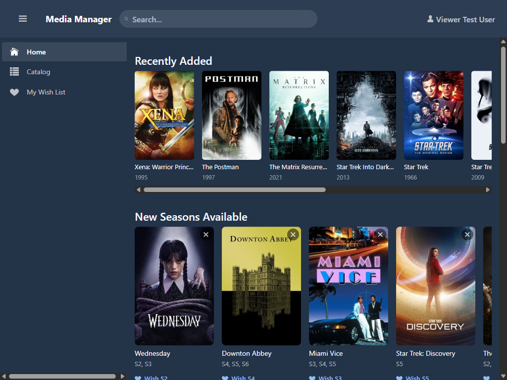
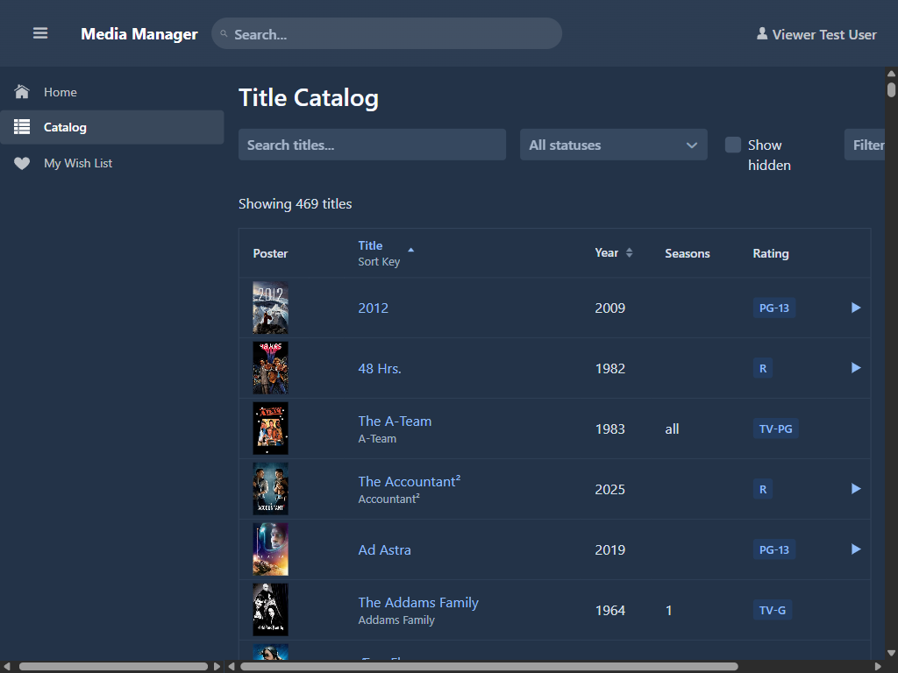
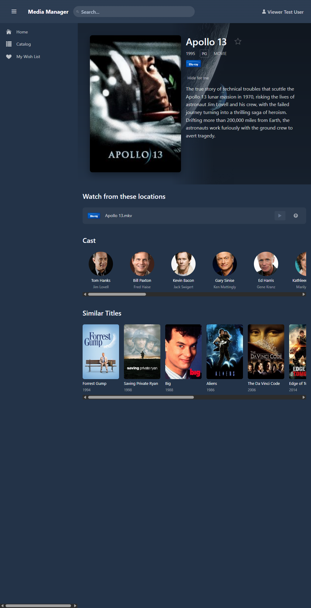
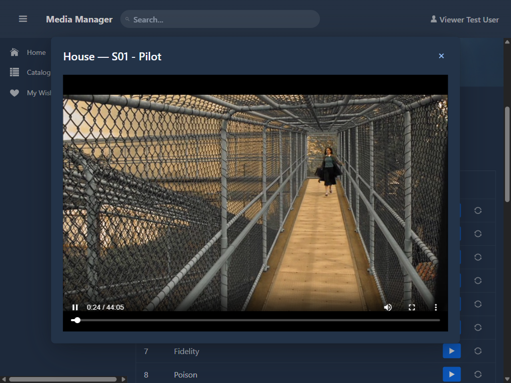

  

# User Guide

Everything you need to know about browsing, searching, and watching your media collection.

---

## Home Screen

The home screen is your personalized dashboard. It shows:

- **Continue Watching** &mdash; Titles you're partway through, with progress bars and a play button to resume instantly. Click the &times; to dismiss.
- **Recently Added** &mdash; The latest titles linked to transcoded files, ready to watch.
- **Recently Watched** &mdash; Titles you've finished recently.
- **New Seasons Available** &mdash; TV shows in your collection where TMDB indicates newer seasons exist. Add them to your wish list or dismiss.

---

## Browsing the Catalog

Open **Catalog** from the sidebar to see your full collection. Every title shows its poster, release year, content rating badge, and media format icon.

### Filtering

- **Search bar** &mdash; Type to filter by title name (see [Search Syntax](#search-syntax) below)
- **Tag filter** &mdash; Select one or more tags from the multi-select dropdown to narrow results (e.g., "Action", "Favorites")
- **Status filter** &mdash; Show titles needing attention (unenriched, unmatched, etc.)

### Sorting

Click any column header to sort. The catalog defaults to alphabetical by sort name.

---

## Search Syntax

The search box in the top navigation bar and the catalog search field both support the same syntax:

| Syntax | Example | Meaning |
|--------|---------|---------|
| `term` | `batman` | Must contain the word (multiple terms are AND'd) |
| `"phrase"` | `"dark knight"` | Exact phrase match |
| `-term` | `-lego` | Exclude titles containing the word |
| `tag:name` | `tag:action` | Filter to titles with a matching tag or genre |

**Combine them freely:** `"dark knight" -sequel tag:action` finds titles containing the exact phrase "dark knight", tagged "action", excluding any with "sequel".

The navbar search also matches **actor names** &mdash; start typing an actor's name and select their result (shown with a headshot) to jump to their filmography page.

---

## Title Detail Page

Click any title to open its detail page.

### What you'll see

- **Hero section** &mdash; Backdrop image, poster, title, year, rating, runtime, genres, and description
- **Play button** &mdash; Green play button appears when a browser-playable transcode exists
- **Cast row** &mdash; Scrollable headshots of the top cast members; click any to see their filmography
- **Tags** &mdash; Colored pill badges showing applied tags; click any to browse that tag
- **Similar Titles** &mdash; Recommendations based on shared genres, cast, and TMDB data
- **TV Episodes** &mdash; For TV series, an episode grid grouped by season with per-episode play buttons and resume indicators

### Actions

- **Star** (star icon) &mdash; Request priority transcoding for this title. When you first set up Media Manager, you may have weeks or months of transcode backlog processed in popularity order. Starring a title bumps it to the top of the queue so it becomes playable sooner. Starred titles show a gold star in the catalog.
- **Hide for me** &mdash; Remove from your personal catalog and search results (doesn't affect other users; reversible from the title detail page)

---

## Watching Videos

### In-Browser Playback

Click the green play button on any title or episode. The video player opens as a dialog overlay.

**Controls:**
- Standard HTML5 video controls (play/pause, volume, fullscreen)
- **Seek thumbnails** &mdash; Hover over the progress bar to see thumbnail previews of the video at that point
- **Resume prompt** &mdash; If you have saved progress, you're offered "Resume from M:SS" or "Start Over"
- **Auto-play next** &mdash; For TV episodes, a "Next Episode" prompt appears near the end with a countdown

**Progress tracking:**
- Your position is saved automatically every 60 seconds and when you pause or close the player
- Progress carries across devices (browser, Roku)
- When you've watched 95% or more, progress is cleared automatically and the title is marked as "Viewed"

### What can I play?

| Source Format | Plays? | How |
|--------------|--------|-----|
| MP4 / M4V | Immediately | Streamed directly |
| MKV / AVI | After transcoding | Background transcoder creates a browser-safe MP4 copy |

The play button only appears once a playable version exists. The transcoding queue prioritizes popular titles and user requests.

---

## Personalizing Your Library

### Priority Transcoding

Star any title from its detail page to request priority transcoding. The background transcoder normally processes titles in decreasing TMDB popularity order, but starred titles jump to the front of the queue. Once transcoded, the play button appears. Starred titles also show a gold star icon in the catalog grid.

### Personal Hide

Don't want to see a title? Click "Hide for me" on its detail page. It vanishes from your catalog, search results, and home screen rows &mdash; but remains visible to other users. To un-hide, navigate directly to the title's URL and click "Unhide."

### Content Rating Ceiling

Your admin may configure a maximum content rating for your account (e.g., PG-13). Titles rated above your ceiling are automatically hidden everywhere &mdash; catalog, search, home screen, and Roku feed. This is account-level, not a parental lock PIN.

### Subtitles

Toggle subtitles on or off from your profile settings. When enabled, subtitles appear automatically during browser and Roku playback for titles that have generated subtitle files.

---

## Wish Lists

Open **My Wish List** from the sidebar. You have two lists:

### Media Wishes

Movies or shows you'd like the collection owner to buy as physical media. Browse actor pages or search TMDB to find titles and add them to your list. Admins see an aggregated view of all users' wishes, sorted by vote count.

### Transcode Wishes

Titles that exist in the catalog but aren't yet playable in the browser (the source MKV hasn't been transcoded to MP4 yet). Request priority transcoding from the title detail page &mdash; wished titles jump ahead in the transcoding queue.

---

## Actor Pages

Click any actor's headshot (from a title detail page or search results) to see their filmography page. This shows:

- Actor photo and name
- **In Your Collection** &mdash; Titles they appear in that you own
- **Other Works** &mdash; Their broader filmography from TMDB, filtered to remove trivial guest appearances. Click any to add it to your media wish list.

---

## Roku Playback

Media Manager includes a custom Roku channel for TV playback. See the [Roku Setup Guide](ROKU_GUIDE.md) for installation. Once paired, your library appears on the Roku with poster art, episode grids, and playback progress synced with the browser.

---

  <a href="index.md">Documentation Home</a> &bull;
  <a href="ADMIN_GUIDE.md">Admin Guide</a> &bull;
  <a href="ROKU_GUIDE.md">Roku Setup</a>

