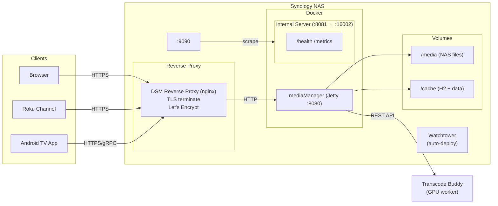

  

<h1 align="center">Media Manager</h1>

  <strong>Your physical media collection, digitized and streamable.</strong> 
  Catalog DVDs, Blu-rays, and UHDs by barcode. Enrich with TMDB metadata. 
  Stream from your NAS to any browser, Roku, or Google TV.

  <a href="GETTING_STARTED.md">Getting Started</a> &bull;
  <a href="USER_GUIDE.md">User Guide</a> &bull;
  <a href="ADMIN_GUIDE.md">Admin Guide</a> &bull;
  <a href="ROKU_GUIDE.md">Roku Setup</a> &bull;
  <a href="ANDROID_TV_GUIDE.md">Android TV Setup</a> &bull;
  <a href="TRANSCODE_BUDDY.md">Transcode Buddy</a> &bull;
  <a href="COMPETITIVE_ANALYSIS.md">Competitive Analysis</a>

---

## What is Media Manager?

Media Manager is a self-hosted web application for people who own physical media (DVD, Blu-ray, UHD, HD DVD). It solves the problem of knowing what you own, finding it, and watching it without getting up to load a disc.

**Catalog** your collection by scanning UPC barcodes. Media Manager looks up the product, identifies the titles inside (even multi-packs), and enriches each title with poster art, descriptions, cast, genres, and content ratings from TMDB.

**Discover** transcoded files on your NAS and automatically match them to catalog titles. The system understands MakeMKV naming conventions and handles movies, TV series with season/episode structure, and multi-disc sets.

**Watch** from any browser, Roku, or Google TV. The built-in video player streams MP4 files directly. MKV and AVI files are automatically transcoded to browser-compatible MP4 in the background, prioritized by popularity. Playback position syncs across devices.

**Organize** with tags, wish lists, favorites, and per-user content rating filters. Each household member gets their own account with personalized views.

**Preserve** family videos alongside your disc collection. Tag family members, set event dates, extract hero images from the video, and browse a timeline of personal recordings with the same playback experience as your movie library.

## Documentation

| Guide | Audience | Covers |
|-------|----------|--------|
| [Getting Started](GETTING_STARTED.md) | Server admin | Installation, configuration, first launch |
| [User Guide](USER_GUIDE.md) | Everyone | Browsing, searching, watching, personalizing |
| [Admin Guide](ADMIN_GUIDE.md) | Administrators | Catalog management, transcoding, user management |
| [Roku Setup](ROKU_GUIDE.md) | Roku users | Channel installation, pairing, playback |
| [Android TV Setup](ANDROID_TV_GUIDE.md) | Google TV / Android TV users | Building, installing, multi-account, playback |
| [Transcode Buddy](TRANSCODE_BUDDY.md) | Server admin | Distributed transcoding with GPU acceleration |
| [Generating Subtitles](GENERATING_SUBTITLES.md) | Server admin | Whisper AI subtitle generation setup |
| [Mac Development Setup](MAC_SETUP.md) | Contributors | macOS prerequisites, building, deploying, iOS development |
| [Feature Tracker](FEATURES.md) | Contributors | Completed features history; open items in [GitHub Issues](https://github.com/jeffbstewart/MediaManager/issues) |
| [Competitive Analysis](COMPETITIVE_ANALYSIS.md) | Contributors | Market positioning vs Plex, Jellyfin, CLZ Movies, and others |

## Quick Start

1. Copy the [`docker-compose.yml`](https://github.com/jeffbstewart/MediaManager/blob/main/docker-compose.yml) to your server (or paste it into Portainer)
2. Set `H2_PASSWORD`, `H2_FILE_PASSWORD`, and `TMDB_API_KEY` ([free signup](https://www.themoviedb.org/settings/api))
3. Update the volume paths to point at your cache directory and media files
4. `docker compose up -d`
5. Open **http://your-host:8080** and create your admin account

See [Getting Started](GETTING_STARTED.md) for the full walkthrough.

## Architecture

The Synology NAS hosts everything: the DSM built-in reverse proxy terminates TLS with a Let's Encrypt certificate and forwards traffic to the mediaManager Docker container on port 8080. The server runs as a single Java process with an embedded Jetty web server. A separate internal Jetty server on port 8081 (mapped to LAN port 16002) serves `/health` and `/metrics` — these are not internet-accessible. Background agents handle barcode lookups, TMDB enrichment, NAS file scanning, and video transcoding. Watchtower monitors for new Docker images and auto-deploys updates. An optional Transcode Buddy worker offloads GPU-intensive transcoding to a separate machine.
